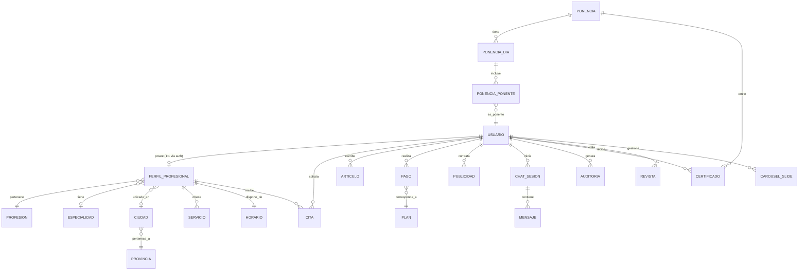

# ERD — Dashboard Profesional EC

> **Modelo Entidad-Relación completo del ecosistema de profesionales**
>  
> Proyecto: `profesionalesecfront` (Next.js + TypeScript)  
> Fecha: 26 mayo 2026  
> Fuente: Extracción de `lib/api.ts`, componentes del dashboard, formularios, y navegación

---

## Diagrama Entidad-Relación (Mermaid ERD)



---

## Catálogo de Entidades

---

### ENTIDAD 1: Usuario
**Descripción:** Representa a cualquier persona registrada en la plataforma (profesional, cliente, o administrador). Es la entidad raíz del sistema.

| Campo | Tipo | Requerido | PK/FK | Descripción | Validación |
|-------|------|-----------|-------|-------------|------------|
| `id` | `number` | ✅ | PK | Identificador único | Auto-generado |
| `nombre` | `string` | ✅ | — | Nombre completo del usuario | — |
| `correo` | `string` | ✅ | — | Email único de registro | Formato email, único |
| `rol_id` | `number` | ✅ | — | Rol del usuario (2 = profesional) | — |
| `foto_url` | `string` | ❌ | — | URL de foto de perfil | Cloudinary |
| `telefono` | `string` | ❌ | — | Número de teléfono | Exactamente 10 dígitos |
| `cedula` | `string` | ❌ | — | Número de cédula/identificación | Exactamente 10 dígitos, numérico |
| `estado` | `string` | ❌ | — | Estado del usuario | — |

**Relaciones:**
- **1:1** con `PERFIL_PROFESIONAL` — un usuario profesional posee exactamente un perfil profesional (vinculación implícita vía token de autenticación).
- **1:N** con `ARTICULO` — un usuario escribe múltiples artículos.
- **1:N** con `CITA` — un usuario (cliente) solicita múltiples citas.
- **1:N** con `PAGO` — un usuario realiza múltiples pagos.
- **1:N** con `PUBLICIDAD` — un usuario publica múltiples anuncios.
- **1:N** con `CHAT_SESION` — un usuario inicia múltiples sesiones de chat.
- **1:N** con `CERTIFICADO` — un usuario recibe múltiples certificados.
- **1:N** con `AUDITORIA` — un usuario genera múltiples registros de auditoría.

**Endpoints API:**
| Método | Ruta | Función |
|--------|------|---------|
| `GET` | `/usuarios/perfil` | `obtenerMiPerfil` |
| `PUT` | `/usuarios/perfil` | `actualizarPerfil` |
| `DELETE` | `/usuarios/mi-cuenta` | Eliminar cuenta propia |

---

### ENTIDAD 2: PerfilProfesional
**Descripción:** Extensión de `Usuario` que contiene toda la información específica del profesional: datos profesionales, ubicación geográfica, tarifas, redes sociales, verificación, y plan de suscripción.

| Campo | Tipo | Requerido | PK/FK | Descripción | Validación |
|-------|------|-----------|-------|-------------|------------|
| `id` | `number` | ❌ | PK | Auto-generado | — |
| `slug` | `string` | ❌ | — | Identificador URL-friendly | Único |
| `profesion_id` | `number` | ✅ | FK → Profesion | Profesión del profesional | Requerido |
| `especialidad_id` | `number` | ❌ | FK → Especialidad | Especialidad filtrada por profesión | — |
| `ciudad_id` | `number` | ❌ | FK → Ciudad | Ciudad de ubicación | — |
| `descripcion` | `string` | ✅ | — | Descripción profesional | Máx. 80 caracteres |
| `telefono` | `string` | ❌ | — | Teléfono de contacto | 10 dígitos |
| `cedula` | `string` | ❌ | — | Cédula profesional | 10 dígitos, numérico |
| `foto_url` | `string` | ❌ | — | URL de foto de perfil profesional | Cloudinary |
| `latitud` | `number` | ❌ | — | Coordenada de latitud | Vía mapa/geolocalización |
| `longitud` | `number` | ❌ | — | Coordenada de longitud | Vía mapa/geolocalización |
| `calle_principal` | `string` | ❌ | — | Dirección de calle | — |
| `referencia` | `string` | ❌ | — | Punto de referencia | — |
| `permitir_reagendar` | `boolean` | ❌ | — | Permite reagendamiento de citas | — |
| `tarifa` | `number` | ❌ | — | Tarifa fija por servicio | Decimal |
| `tarifa_hora` | `number` | ❌ | — | Tarifa por hora | Decimal |
| `plan` | `string` | ❌ | — | Nivel de plan de suscripción | — |
| `comprobante_pago_url` | `string` | ❌ | — | URL del comprobante de pago | Temporal |
| `payment_method` | `string` | ❌ | — | Método de pago | `"payphone"` o `"bank"` |
| `payphone_flow` | `boolean` | ❌ | — | Indica flujo de pago PayPhone | — |
| `facebook_url` | `string` | ❌ | — | URL de Facebook | Validación regex de plataforma |
| `instagram_url` | `string` | ❌ | — | URL de Instagram | Validación regex de plataforma |
| `tiktok_url` | `string` | ❌ | — | URL de TikTok | Validación regex de plataforma |
| `linkedin_url` | `string` | ❌ | — | URL de LinkedIn | Validación regex de plataforma |
| `x_url` | `string` | ❌ | — | URL de Twitter/X | Validación regex de plataforma |
| `yt_url` | `string` | ❌ | — | URL de YouTube | Validación regex de plataforma |
| `show_phone` | `boolean` | ❌ | — | Mostrar teléfono públicamente | Checkbox |
| `show_email` | `boolean` | ❌ | — | Mostrar email públicamente | Checkbox |
| `verificado` | `boolean` | ❌ | — | Estado de verificación del perfil | — |

**Relaciones:**
- **1:1** con `USUARIO` — vinculación implícita vía autenticación.
- **N:1** con `PROFESION` — pertenece a una profesión del catálogo.
- **N:1** con `ESPECIALIDAD` — puede tener una especialidad del catálogo.
- **N:1** con `CIUDAD` — ubicado en una ciudad del catálogo.
- **1:N** con `SERVICIO` — ofrece múltiples servicios.
- **1:1** con `HORARIO` — dispone de un horario de disponibilidad.
- **1:N** con `CITA` — recibe múltiples citas.

**Endpoints API:**
| Método | Ruta | Función |
|--------|------|---------|
| `POST` | `/profesionales/crear-perfil` | Registro completo del profesional |
| `PUT` | `/profesionales/actualizar-perfil` | Actualización parcial o total |
| `GET` | `/profesionales/perfil` | Obtener perfil propio |
| `GET` | `/profesionales/verificados` | Listar profesionales verificados |
| `GET` | `/profesionales/publico/{slug}` | Perfil público por slug |
| `GET` | `/profesionales/destacados` | Listar profesionales destacados |
| `GET` | `/profesionales/buscar` | Búsqueda con filtros |
| `GET` | `/profesionales/cercanos` | Búsqueda por proximidad geográfica |
| `POST` | `/profesionales/documentos` | Subir documentos de verificación |
| `POST` | `/profesionales/comprobante-pago` | Subir comprobante de pago |
| `POST` | `/profesionales/ubicacion` | Actualizar ubicación geográfica |
| `PUT` | `/profesionales/estado-perfil/{id}` | Cambiar estado del perfil (admin) |

---

### ENTIDAD 3: PerfilProfesionalSummary (DTO)
**Descripción:** Proyección ligera de `PerfilProfesional` usada en resultados de búsqueda y listados. **No es una entidad de base de datos**, sino un DTO de lectura.

| Campo | Tipo | Descripción |
|-------|------|-------------|
| `id` | `number` | ID del perfil |
| `slug` | `string?` | Slug URL-friendly |
| `profesion_id` | `number` | FK a Profesion |
| `especialidad_id` | `number?` | FK a Especialidad |
| `profesion` | `{id, nombre}?` | Objeto anidado: profesión |
| `especialidad` | `{id, nombre}?` | Objeto anidado: especialidad |

---

### ENTIDAD 4: Servicio
**Descripción:** Servicio individual ofrecido por un profesional. Cada profesional puede tener múltiples servicios con su descripción.

| Campo | Tipo | Requerido | PK/FK | Descripción | Validación |
|-------|------|-----------|-------|-------------|------------|
| `servicio_id` | `number` | ✅ | PK | Identificador único | Auto-generado |
| `descripcion` | `string` | ✅ | — | Descripción del servicio | Máx. 100 caracteres |
| `perfil_id` | `number` | ✅ | FK → PerfilProfesional | Profesional que ofrece el servicio | Requerido |

**Relaciones:**
- **N:1** con `PERFIL_PROFESIONAL` — pertenece a un profesional.

**Endpoints API:**
| Método | Ruta | Función |
|--------|------|---------|
| `GET` | `/servicios/mis-servicios?perfilId={id}` | Listar servicios propios |
| `POST` | `/servicios` | Crear servicio: `{perfilId, descripcion}` |
| `PUT` | `/servicios/{id}` | Actualizar: `{descripcion}` |
| `DELETE` | `/servicios/{id}` | Eliminar servicio |
| `GET` | `/servicios/perfil/{slug}` | Listar servicios por perfil (público) |

---

### ENTIDAD 5: Horario
**Descripción:** Matriz de disponibilidad horaria semanal del profesional. Representa 168 bloques (7 días × 24 horas) donde cada elemento booleano indica disponibilidad.

| Campo | Tipo | Requerido | PK/FK | Descripción | Validación |
|-------|------|-----------|-------|-------------|------------|
| `matriz` | `boolean[]` | ✅ | — | Array de 168 elementos (7 días × 24h) | Longitud exacta: 168 |
| `perfil_id` | `number` | ✅ | FK → PerfilProfesional | Profesional dueño del horario | Requerido |

**Estructura de la matriz:**
- **Días:** Lunes (índice 0) a Domingo (índice 6).
- **Horas:** 0–23 por día.
- **Cálculo de índice:** `día × 24 + hora`.
- **Mapeo JS:** `getDay()` → 0=Dom → matriz[6], 1=Lun → matriz[0], ..., 6=Sáb → matriz[5].

**Relaciones:**
- **1:1** con `PERFIL_PROFESIONAL` — cada profesional tiene exactamente un horario.

**Endpoints API:**
| Método | Ruta | Función |
|--------|------|---------|
| `GET` | `/horarios/perfil/{perfilId}` | Obtener horario por perfil |
| `POST` | `/horarios/actualizar` | Actualizar matriz: `{perfilId, matriz}` |
| `GET` | `/horarios/publico/{slug}` | Obtener horario público por slug |

---

### ENTIDAD 6: Cita
**Descripción:** Cita o reserva entre un cliente y un profesional. Soporta dos flujos: agendamiento público (sin autenticación) y agendamiento privado (con token).

| Campo | Tipo | Requerido | PK/FK | Descripción | Validación |
|-------|------|-----------|-------|-------------|------------|
| `id` | `number` | ✅ | PK | Identificador único | Auto-generado |
| `profesional_id` | `number` | ✅ | FK → PerfilProfesional | Profesional que recibe la cita | Requerido |
| `usuario_id` | `number` | ❌ | FK → Usuario | Cliente que solicita (si está autenticado) | — |
| `nombres_completos` | `string` | ❌ | — | Nombre del cliente (flujo público) | Requerido si no hay usuario_id |
| `correo` | `string` | ❌ | — | Email del cliente (flujo público) | Formato email |
| `telefono` | `string` | ❌ | — | Teléfono del cliente | 10 dígitos, patrón `[0-9]{10}` |
| `comentario` | `string` | ❌ | — | Mensaje opcional para el profesional | — |
| `fecha_cita` | `string` | ✅ | — | Fecha de la cita | Formato `YYYY-MM-DD` |
| `hora_cita` | `string` | ✅ | — | Hora de la cita | Formato `HH:00` (bloques de 1h) |
| `estado_id` | `number` | ✅ | — | Estado de la cita | FK a catálogo de estados |
| `fecha_hora` | `string` | ❌ | — | Fecha y hora combinadas (reagendamiento) | Formato datetime |
| `created_at` | `string` | ✅ | — | Fecha de creación | Auto-generado |

**Relaciones:**
- **N:1** con `PERFIL_PROFESIONAL` — la cita pertenece a un profesional.
- **N:1** con `USUARIO` — la cita es solicitada por un cliente.

**Endpoints API:**
| Método | Ruta | Función |
|--------|------|---------|
| `POST` | `/citas/publico` | Agendar cita sin autenticación |
| `POST` | `/citas` | Agendar cita con token |
| `GET` | `/citas` | Listar citas del usuario autenticado |
| `PUT` | `/citas/{id}/estado` | Cambiar estado: `{estado_id}` |
| `PUT` | `/citas/{id}/reagendar` | Reagendar: `{fecha_cita, hora_cita}` |

---

### ENTIDAD 7: Artículo
**Descripción:** Artículo o publicación de blog escrito por un profesional. Soporta contenido textual, imágenes de portada, archivos PDF adjuntos, y un flujo de moderación con estados (borrador, publicado, archivado).

| Campo | Tipo | Requerido | PK/FK | Descripción | Validación |
|-------|------|-----------|-------|-------------|------------|
| `id` | `number` | ✅ | PK | Identificador único | Auto-generado |
| `usuario_id` | `number` | ✅ | FK → Usuario | Autor del artículo | Requerido |
| `titulo` | `string` | ✅ | — | Título del artículo | Requerido |
| `contenido` | `string` | ✅ | — | Cuerpo del artículo (texto/HTML) | Requerido |
| `resumen` | `string` | ❌ | — | Resumen o extracto | — |
| `imagen_url` | `string` | ❌ | — | URL de imagen de portada | — |
| `pdf_url` | `string` | ❌ | — | URL de documento PDF adjunto | — |
| `estado` | `enum` | ✅ | — | Estado editorial | `"borrador"` | `"publicado"` | `"archivado"` |
| `fecha_publicacion` | `string` | ✅ | — | Fecha de publicación | Formato fecha |
| `created_at` | `string` | ✅ | — | Fecha de creación | Auto-generado |
| `updated_at` | `string` | ✅ | — | Fecha de última modificación | Auto-generado |
| `autor` | `object` | ❌ | — | Datos del autor anidados | `{id, nombre, correo?, foto_url?, perfiles_profesionales?}` |

**Relaciones:**
- **N:1** con `USUARIO` — cada artículo pertenece a un autor.

**Endpoints API:**
| Método | Ruta | Función |
|--------|------|---------|
| `GET` | `/articulos` | Listar publicados (filtros: `profesionIds?`, `perfil_slug?`, `limit?`, `page?`, `keyword?`) |
| `GET` | `/articulos/{id}` | Obtener por ID |
| `GET` | `/articulos/mios` | Listar artículos del profesional autenticado |
| `POST` | `/articulos` | Crear artículo (FormData o JSON) |
| `PUT` | `/articulos/{id}` | Actualizar artículo |
| `DELETE` | `/articulos/{id}` | Eliminar artículo |
| `PUT` | `/articulos/{id}/moderar` | Aprobar/moderar artículo (admin) |
| `PUT` | `/articulos/{id}/archivar` | Archivar artículo |
| `GET` | `/articulos/admin/todos` | Listar todos (admin) |

---

### ENTIDAD 8: Pago
**Descripción:** Registro de pago realizado por un usuario para adquirir un plan de suscripción. Incluye método, monto y estado.

| Campo | Tipo | Requerido | PK/FK | Descripción | Validación |
|-------|------|-----------|-------|-------------|------------|
| `id` | `number` | ✅ | PK | Identificador único | Auto-generado |
| `usuario_id` | `number` | ✅ | FK → Usuario | Usuario que realiza el pago | Requerido |
| `plan_id` | `number` | ✅ | FK → Plan | Plan adquirido | Requerido |
| `monto` | `number` | ✅ | — | Monto del pago | Decimal |
| `metodo` | `string` | ✅ | — | Método de pago | `"bank"`, `"payphone"`, etc. |
| `referencia` | `string` | ❌ | — | Número de referencia de la transacción | — |
| `estado` | `string` | ✅ | — | Estado del pago | `"pendiente"`, `"confirmado"`, etc. |
| `created_at` | `string` | ✅ | — | Fecha de creación | Auto-generado |

**Relaciones:**
- **N:1** con `USUARIO` — cada pago pertenece a un usuario.
- **N:1** con `PLAN` — cada pago corresponde a un plan.

**Endpoints API:**
| Método | Ruta | Función |
|--------|------|---------|
| `POST` | `/pagos` | Registrar nuevo pago |
| `GET` | `/pagos` | Listar pagos |
| `PUT` | `/pagos/{id}/confirmar` | Confirmar pago (admin) |

---

### ENTIDAD 9: Plan
**Descripción:** Plan de suscripción disponible para profesionales. Define precio, duración y estado de activación.

| Campo | Tipo | Requerido | PK/FK | Descripción | Validación |
|-------|------|-----------|-------|-------------|------------|
| `id` | `number` | ✅ | PK | Identificador único | Auto-generado |
| `nombre` | `string` | ✅ | — | Nombre del plan | — |
| `precio` | `number` | ✅ | — | Precio del plan | Decimal |
| `duracion_dias` | `number` | ✅ | — | Duración en días | Entero positivo |
| `descripcion` | `string` | ❌ | — | Descripción detallada | — |
| `activo` | `boolean` | ✅ | — | Si el plan está activo | — |

**Relaciones:**
- **1:N** con `PAGO` — un plan puede ser adquirido mediante múltiples pagos.

**Endpoints API:**
| Método | Ruta | Función |
|--------|------|---------|
| `GET` | `/planes/listar-planes` | Listar planes disponibles |
| `POST` | `/planes/crear` | Crear plan (admin) |
| `PUT` | `/planes/{id}` | Actualizar plan (admin) |

---

### ENTIDAD 10: BankAccount
**Descripción:** Cuenta bancaria registrada en el sistema para recibir pagos por transferencia. Usada en el flujo de pago prioritario (opción "bank").

| Campo | Tipo | Requerido | PK/FK | Descripción | Validación |
|-------|------|-----------|-------|-------------|------------|
| `id` | `number` | ✅ | PK | Identificador único | Auto-generado |
| `bank_name` | `string` | ✅ | — | Nombre del banco | — |
| `account_type` | `string` | ✅ | — | Tipo de cuenta | — |
| `account_number` | `string` | ✅ | — | Número de cuenta | — |
| `holder_identifier` | `string` | ✅ | — | RUC/Identificación del titular | — |
| `holder_name` | `string` | ✅ | — | Nombre del titular | — |
| `email` | `string` | ❌ | — | Correo asociado | — |
| `is_active` | `boolean` | ✅ | — | Si la cuenta está activa | — |
| `created_at` | `string` | ✅ | — | Fecha de creación | Auto-generado |
| `updated_at` | `string` | ✅ | — | Fecha de última modificación | Auto-generado |

**Endpoints API:**
| Método | Ruta | Función |
|--------|------|---------|
| `GET` | `/bank-accounts` | Listar cuentas bancarias activas |
| `GET` | `/bank-accounts/admin` | Listar todas (admin) |
| `POST` | `/bank-accounts` | Crear cuenta bancaria (admin) |
| `PUT` | `/bank-accounts/{id}` | Actualizar cuenta (admin) |
| `PATCH` | `/bank-accounts/{id}/status` | Cambiar estado activo/inactivo |

---

### ENTIDAD 11: Ponencia
**Descripción:** Conferencia, evento o congreso profesional. Puede tener múltiples días, ponentes, galería de fotos, video, banner, y precios. Es una entidad rica para eventos presenciales o virtuales.

| Campo | Tipo | Requerido | PK/FK | Descripción | Validación |
|-------|------|-----------|-------|-------------|------------|
| `id` | `number` | ✅ | PK | Identificador único | Auto-generado |
| `slug` | `string` | ❌ | — | Identificador URL-friendly | Único |
| `titulo` | `string` | ✅ | — | Título del evento | — |
| `descripcion` | `string` | ✅ | — | Descripción del evento | — |
| `fecha_inicio` | `string` | ✅ | — | Fecha de inicio | — |
| `hora_inicio` | `string` | ❌ | — | Hora de inicio | — |
| `fecha_fin` | `string` | ✅ | — | Fecha de fin | — |
| `hora_fin` | `string` | ❌ | — | Hora de fin | — |
| `subtitulo` | `string` | ❌ | — | Subtítulo del evento | — |
| `profesion_id` | `number` | ✅ | FK → Profesion | Profesión objetivo | — |
| `precio` | `number` | ✅ | — | Precio de entrada | Decimal |
| `cupo` | `number` | ✅ | — | Capacidad máxima | Entero positivo |
| `estado` | `string` | ✅ | — | Estado del evento | — |
| `provincia_id` | `number` | ❌ | FK → Provincia | Provincia del evento | — |
| `ciudad_id` | `number` | ❌ | FK → Ciudad | Ciudad del evento | — |
| `ciudad` | `{id, nombre}?` | ❌ | — | Objeto anidado: ciudad | — |
| `provincia` | `{id, nombre}?` | ❌ | — | Objeto anidado: provincia | — |
| `direccion` | `string` | ❌ | — | Dirección del evento | — |
| `latitud` | `number` | ❌ | — | Latitud geográfica | — |
| `longitud` | `number` | ❌ | — | Longitud geográfica | — |
| `imagen_banner` | `string` | ❌ | — | URL del banner principal | — |
| `video_url` | `string` | ❌ | — | URL promocional del evento | — |
| `galeria_fotos` | `string[]` | ❌ | — | URLs de galería de fotos | Array de strings |
| `es_destacado` | `boolean` | ❌ | — | Si el evento es destacado | — |
| `url_revista_general` | `string` | ❌ | — | URL de revista general del evento | — |
| `foto_revista_general` | `string` | ❌ | — | Foto de portada de revista | — |
| `resumen_formato` | `string` | ❌ | — | Resumen de formato | — |
| `dias` | `PonenciaDia[]` | ❌ | — | Días de la conferencia (anidados) | — |

**Relaciones:**
- **1:N** con `PONENCIA_DIA` — una ponencia tiene múltiples días.
- **1:N** con `CERTIFICADO` — una ponencia emite múltiples certificados.
- **N:1** con `PROFESION` — la ponencia está dirigida a una profesión.
- **N:1** con `PROVINCIA` — ubicada en una provincia.
- **N:1** con `CIUDAD` — ubicada en una ciudad.

---

### ENTIDAD 12: PonenciaDia
**Descripción:** Día individual dentro de una ponencia/conferencia. Cada día puede tener un orden, título, horario y lista de ponentes.

| Campo | Tipo | Requerido | PK/FK | Descripción | Validación |
|-------|------|-----------|-------|-------------|------------|
| `id` | `number` | ❌ | PK | Identificador único | — |
| `ponencia_id` | `number` | ❌ | FK → Ponencia | Ponencia a la que pertenece | — |
| `fecha` | `string` | ✅ | — | Fecha del día | — |
| `orden` | `number` | ✅ | — | Orden del día dentro de la ponencia | — |
| `titulo_dia` | `string` | ❌ | — | Título descriptivo del día | — |
| `hora_inicio` | `string` | ❌ | — | Hora de inicio del día | — |
| `hora_fin` | `string` | ❌ | — | Hora de fin del día | — |
| `ponentes` | `PonenciaPonente[]` | ❌ | — | Ponentes de este día (anidados) | — |

**Relaciones:**
- **N:1** con `PONENCIA` — el día pertenece a una ponencia.
- **1:N** con `PONENCIA_PONENTE` — un día incluye múltiples ponentes.

---

### ENTIDAD 13: PonenciaPonente
**Descripción:** Ponente o conferencista asignado a un día específico de una ponencia. Contiene información profesional, tema de la charla, y recursos multimedia como foto, banner, galería y video.

| Campo | Tipo | Requerido | PK/FK | Descripción | Validación |
|-------|------|-----------|-------|-------------|------------|
| `id` | `number` | ❌ | PK | Identificador único | — |
| `ponencia_id` | `number` | ❌ | FK → Ponencia | Ponencia del ponente | — |
| `dia_id` | `number` | ❌ | FK → PonenciaDia | Día específico | — |
| `usuario_id` | `number` | ❌ | FK → Usuario | Usuario que es ponente | — |
| `nombre_ponente` | `string` | ❌ | — | Nombre para mostrar | — |
| `profesion` | `string` | ❌ | — | Profesión del ponente | — |
| `tema_charla` | `string` | ❌ | — | Tema de la presentación | — |
| `foto_revista_url` | `string` | ❌ | — | Foto para revista | — |
| `url_revista_personal` | `string` | ❌ | — | URL personal de revista | — |
| `slug` | `string` | ❌ | — | Slug del ponente | — |
| `biografia` | `string` | ❌ | — | Biografía del ponente | — |
| `video_url` | `string` | ❌ | — | Video promocional | — |
| `slogan` | `string` | ❌ | — | Eslogan o frase del ponente | — |
| `fondo_banner` | `string` | ❌ | — | Imagen de fondo (Premium) | — |
| `galeria_fotos` | `string[]` | ❌ | — | Galería de fotos (Premium) | Array de strings |
| `orden` | `number` | ✅ | — | Orden de aparición | — |
| `usuario` | `object` | ❌ | — | Objeto anidado del usuario | `{id, nombre, foto_url?}` |

**Relaciones:**
- **N:1** con `PONENCIA` — pertenece a una ponencia.
- **N:1** con `PONENCIA_DIA` — asignado a un día específico.
- **N:1** con `USUARIO` — el ponente es un usuario registrado.

---

### ENTIDAD 14: Publicidad
**Descripción:** Anuncio o publicidad contratada por un usuario. Se ubica en posiciones específicas (por slug), tiene fechas de vigencia, tipo de contenido e imagen.

| Campo | Tipo | Requerido | PK/FK | Descripción | Validación |
|-------|------|-----------|-------|-------------|------------|
| `id` | `number` | ✅ | PK | Identificador único | Auto-generado |
| `usuario_id` | `number` | ✅ | FK → Usuario | Anunciante | Requerido |
| `ubicacion_slug` | `string` | ✅ | — | Slug de ubicación del anuncio | — |
| `tipo` | `string` | ✅ | — | Tipo de anuncio | — |
| `titulo` | `string` | ✅ | — | Título del anuncio | — |
| `contenido` | `string` | ❌ | — | Contenido textual | — |
| `url_destino` | `string` | ❌ | — | URL de destino al hacer clic | — |
| `fecha_inicio` | `string` | ✅ | — | Fecha de inicio de vigencia | — |
| `fecha_fin` | `string` | ✅ | — | Fecha de fin de vigencia | — |
| `imagen_url` | `string` | ❌ | — | Imagen del anuncio | — |
| `estado` | `string` | ✅ | — | Estado del anuncio | — |

**Relaciones:**
- **N:1** con `USUARIO` — cada anuncio pertenece a un usuario.

---

### ENTIDAD 15: Revista
**Descripción:** Revista o publicación digital. Contiene portada, PDF, edición y estado de activación. Similar a un magazine digital dentro de la plataforma.

| Campo | Tipo | Requerido | PK/FK | Descripción | Validación |
|-------|------|-----------|-------|-------------|------------|
| `id` | `number` | ✅ | PK | Identificador único | Auto-generado |
| `titulo` | `string` | ✅ | — | Título de la revista | — |
| `descripcion` | `string` | ✅ | — | Descripción de la revista | — |
| `portada_url` | `string` | ❌ | — | URL de la imagen de portada | — |
| `pdf_url` | `string` | ✅ | — | URL del PDF de la revista | Requerido |
| `fecha_publicacion` | `string` | ✅ | — | Fecha de publicación | — |
| `edicion` | `string` | ❌ | — | Número o nombre de edición | — |
| `activo` | `boolean` | ✅ | — | Si la revista está activa/visible | — |

---

### ENTIDAD 16: Certificado
**Descripción:** Certificado de asistencia o participación emitido para una ponencia. Vincula a un usuario con una ponencia y contiene un código único verificable.

| Campo | Tipo | Requerido | PK/FK | Descripción | Validación |
|-------|------|-----------|-------|-------------|------------|
| `id` | `number` | ✅ | PK | Identificador único | Auto-generado |
| `codigo` | `string` | ✅ | — | Código único de verificación | Único |
| `usuario_id` | `number` | ✅ | FK → Usuario | Usuario que recibe el certificado | Requerido |
| `ponencia_id` | `number` | ✅ | FK → Ponencia | Ponencia del certificado | Requerido |
| `url_pdf` | `string` | ✅ | — | URL del certificado en PDF | — |
| `fecha_emision` | `string` | ✅ | — | Fecha de emisión del certificado | — |

**Relaciones:**
- **N:1** con `USUARIO` — el certificado pertenece a un usuario.
- **N:1** con `PONENCIA` — el certificado corresponde a una ponencia.

---

### ENTIDAD 17: Auditoria
**Descripción:** Registro de auditoría (log) que captura acciones realizadas en el sistema. Cada entrada registra el módulo, acción, descripción, IP de origen y usuario responsable.

| Campo | Tipo | Requerido | PK/FK | Descripción | Validación |
|-------|------|-----------|-------|-------------|------------|
| `id` | `number` | ✅ | PK | Identificador único | Auto-generado |
| `modulo` | `string` | ✅ | — | Módulo del sistema donde ocurrió la acción | — |
| `accion` | `string` | ✅ | — | Acción realizada (ej. "crear", "eliminar") | — |
| `descripcion` | `string` | ✅ | — | Descripción detallada | — |
| `ip_origen` | `string` | ❌ | — | Dirección IP de origen | — |
| `usuario_id` | `number` | ✅ | FK → Usuario | Usuario que ejecutó la acción | Requerido |
| `created_at` | `string` | ✅ | — | Fecha y hora del evento | Auto-generado |

**Relaciones:**
- **N:1** con `USUARIO` — cada registro de auditoría pertenece a un usuario.

---

### ENTIDAD 18: ChatSesion
**Descripción:** Sesión de chat (probablemente chatbot o soporte) iniciada por un usuario. Agrupa una conversación completa.

| Campo | Tipo | Requerido | PK/FK | Descripción | Validación |
|-------|------|-----------|-------|-------------|------------|
| `id` | `number` | ✅ | PK | Identificador único | Auto-generado |
| `usuario_id` | `number` | ✅ | FK → Usuario | Usuario que inició la sesión | Requerido |
| `direccion_id` | `number` | ❌ | — | Dirección o contexto del chat | — |
| `estado` | `string` | ✅ | — | Estado de la sesión | `"activo"`, `"cerrado"`, etc. |
| `created_at` | `string` | ✅ | — | Fecha de creación | Auto-generado |

**Relaciones:**
- **N:1** con `USUARIO` — la sesión pertenece a un usuario.
- **1:N** con `MENSAJE` — la sesión contiene múltiples mensajes.

---

### ENTIDAD 19: Mensaje
**Descripción:** Mensaje individual dentro de una sesión de chat. Distingue entre mensajes del usuario y del asistente (bot).

| Campo | Tipo | Requerido | PK/FK | Descripción | Validación |
|-------|------|-----------|-------|-------------|------------|
| `id` | `number` | ✅ | PK | Identificador único | Auto-generado |
| `chat_sesion_id` | `number` | ✅ | FK → ChatSesion | Sesión de chat a la que pertenece | Requerido |
| `rol` | `enum` | ✅ | — | Rol del emisor | `"usuario"` \| `"asistente"` |
| `contenido` | `string` | ✅ | — | Contenido del mensaje | — |
| `created_at` | `string` | ✅ | — | Fecha de envío | Auto-generado |

**Relaciones:**
- **N:1** con `CHAT_SESION` — cada mensaje pertenece a una sesión.

---

### ENTIDAD 20: Entidades Transaccionales — PayPhone Priority

**Descripción:** Tipos usados exclusivamente en el flujo de pago prioritario vía PayPhone.
**No son entidades persistentes** de base de datos; son DTOs de transferencia entre frontend y backend durante el checkout.

| Tipo | Propósito |
|------|-----------|
| `PayPhonePriorityTransaction` | Transacción de pago en curso |
| `PayPhonePriorityCheckout` | Datos del checkout de PayPhone |
| `PayPhonePriorityPreparePayload` | Payload de preparación de pago |
| `PayPhonePriorityRegistrationDraft` | Borrador completo de registro (modo, datos, horario, servicios, documentos) |
| `PayPhonePriorityProfileDraft` | Borrador del perfil (espejo de `PerfilProfesionalData` + URLs sociales) |
| `PayPhonePriorityDocumentDraft` | Borrador de documento (`{tipo, url}`) |
| `PayPhonePriorityServiceDraft` | Borrador de servicio (`{descripcion}`) |
| `PayPhonePriorityConfirmData` | Datos de confirmación (`{approved, reviewRequired, transaction, confirmation}`) |

---

## Entidades de Catálogo (Lookup Tables)

Estas entidades proveen datos de referencia (listas desplegables) usados por formularios de registro y búsqueda. Siguen un patrón común `CatalogItem { id, nombre }`.

### Profesion
| Campo | Tipo | PK/FK | Descripción |
|-------|------|-------|-------------|
| `id` | `number` | PK | Identificador único |
| `nombre` | `string` | — | Nombre de la profesión |

**API:** `GET /catalogos/profesiones`

**Relaciones:**
- **1:N** con `PERFIL_PROFESIONAL` — una profesión agrupa múltiples perfiles.
- **1:N** con `ESPECIALIDAD` — una profesión tiene múltiples especialidades.
- **1:N** con `PONENCIA` — eventos dirigidos a una profesión.

### Especialidad
| Campo | Tipo | PK/FK | Descripción |
|-------|------|-------|-------------|
| `id` | `number` | PK | Identificador único |
| `nombre` | `string` | — | Nombre de la especialidad |
| `profesion_id` | `number` | FK → Profesion | Profesión padre |

**API:** `GET /catalogos/especialidades?profesion_id=`

**Relaciones:**
- **1:N** con `PERFIL_PROFESIONAL` — una especialidad agrupa múltiples perfiles.
- **N:1** con `PROFESION` — pertenece a una profesión.

### Provincia
| Campo | Tipo | PK/FK | Descripción |
|-------|------|-------|-------------|
| `id` | `number` | PK | Identificador único |
| `nombre` | `string` | — | Nombre de la provincia |

**API:** `GET /catalogos/provincias`

**Relaciones:**
- **1:N** con `CIUDAD` — una provincia contiene múltiples ciudades.

### Ciudad
| Campo | Tipo | PK/FK | Descripción |
|-------|------|-------|-------------|
| `id` | `number` | PK | Identificador único |
| `nombre` | `string` | — | Nombre de la ciudad |
| `provincia_id` | `number` | FK → Provincia | Provincia padre |

**API:** `GET /catalogos/ciudades?provincia_id=`

**Relaciones:**
- **1:N** con `PERFIL_PROFESIONAL` — una ciudad agrupa múltiples perfiles.
- **N:1** con `PROVINCIA` — pertenece a una provincia.

---

### ManagedCarouselSlide
**Descripción:** Slide de carrusel gestionable (hero/banner rotativo). Entidad independiente sin FK hacia otras entidades del dominio.

| Campo | Tipo | Requerido | PK/FK | Descripción |
|-------|------|-----------|-------|-------------|
| `id` | `number` | ✅ | PK | Identificador único |
| `placementKey` | `string` | ✅ | — | Identificador de ubicación del carrusel |
| `title` | `string` | ✅ | — | Título del slide |
| `subtitle` | `string` | ❌ | — | Subtítulo |
| `imageUrl` | `string` | ✅ | — | URL de la imagen |
| `imagePublicId` | `string` | ❌ | — | ID pública de Cloudinary |
| `ctaLabel` | `string` | ❌ | — | Texto del botón de llamado a acción |
| `ctaUrl` | `string` | ❌ | — | URL del llamado a acción |
| `sortOrder` | `number` | ✅ | — | Orden de visualización |
| `isActive` | `boolean` | ✅ | — | Si el slide está activo |

**Fuente:** `lib/validators/carousel.ts`

---

## Resumen de Relaciones

| Origen | Relación | Destino | Cardinalidad | Descripción |
|--------|----------|---------|:------------:|-------------|
| Usuario | posee | PerfilProfesional | **1:1** | Un usuario profesional tiene un perfil (vía auth) |
| Usuario | escribe | Artículo | **1:N** | Un usuario publica múltiples artículos |
| Usuario | solicita | Cita | **1:N** | Un cliente agenda múltiples citas |
| Usuario | realiza | Pago | **1:N** | Un usuario hace múltiples pagos |
| Usuario | contrata | Publicidad | **1:N** | Un usuario publica múltiples anuncios |
| Usuario | inicia | ChatSesion | **1:N** | Un usuario abre múltiples sesiones de chat |
| Usuario | recibe | Certificado | **1:N** | Un usuario obtiene múltiples certificados |
| Usuario | genera | Auditoria | **1:N** | Cada acción queda registrada en auditoría |
| PerfilProfesional | pertenece | Profesion | **N:1** | Todo perfil tiene una profesión |
| PerfilProfesional | tiene | Especialidad | **N:1** | Perfil con especialidad opcional |
| PerfilProfesional | ubicado_en | Ciudad | **N:1** | Perfil en una ciudad |
| PerfilProfesional | ofrece | Servicio | **1:N** | Un profesional lista múltiples servicios |
| PerfilProfesional | dispone_de | Horario | **1:1** | Un profesional tiene un horario |
| PerfilProfesional | recibe | Cita | **1:N** | Un profesional tiene múltiples citas |
| Ciudad | pertenece_a | Provincia | **N:1** | Ciudad dentro de una provincia |
| Pago | corresponde_a | Plan | **N:1** | Cada pago es para un plan |
| Ponencia | tiene | PonenciaDia | **1:N** | Una ponencia tiene múltiples días |
| PonenciaDia | incluye | PonenciaPonente | **1:N** | Un día tiene múltiples ponentes |
| PonenciaPonente | es_ponente | Usuario | **N:1** | Ponente vinculado a un usuario |
| Ponencia | emite | Certificado | **1:N** | Una ponencia emite certificados |
| ChatSesion | contiene | Mensaje | **1:N** | Una sesión tiene múltiples mensajes |
| Especialidad | pertenece_a | Profesion | **N:1** | Especialidad dentro de una profesión |

---

## Agrupación por Dominios

### 🔷 Núcleo (Core)
Entidades fundamentales del sistema: usuarios, perfiles y catálogos.
- **`Usuario`** — entidad raíz de autenticación e identidad.
- **`PerfilProfesional`** — extensión profesional del usuario.
- **`Profesion`** — catálogo de profesiones.
- **`Especialidad`** — catálogo de especialidades.
- **`Provincia`** — catálogo de provincias.
- **`Ciudad`** — catálogo de ciudades.

### 🔶 Servicios
Lo que el profesional ofrece.
- **`Servicio`** — servicios individuales ofrecidos.
- **`Horario`** — matriz de disponibilidad semanal (168 bloques).

### 🟢 Agenda (Appointments)
Gestión de citas entre clientes y profesionales.
- **`Cita`** — reserva con fecha, hora, estado y datos del cliente.

### 🟣 Contenido (Content)
Publicaciones y recursos editoriales.
- **`Artículo`** — blog posts con flujo de moderación.
- **`Revista`** — publicaciones digitales tipo magazine.
- **`ManagedCarouselSlide`** — slides de carrusel gestionables.

### 🟡 Pagos (Billing)
Suscripciones y transacciones.
- **`Pago`** — registro de transacción.
- **`Plan`** — plan de suscripción.
- **`BankAccount`** — cuenta bancaria para transferencias.

### 🔴 Social
Redes integradas en el perfil profesional.
- *(Embebido en `PerfilProfesional`: `facebook_url`, `instagram_url`, `tiktok_url`, `linkedin_url`, `x_url`, `yt_url`)*

### 🔵 Conferencias (Events)
Eventos, ponencias y certificaciones.
- **`Ponencia`** — evento/conferencia.
- **`PonenciaDia`** — día de la ponencia.
- **`PonenciaPonente`** — conferencista/ponente.
- **`Certificado`** — certificado de asistencia.

### ⚪ Administración (Admin)
Herramientas de gestión y control.
- **`Auditoria`** — log de acciones del sistema.
- **`Publicidad`** — anuncios contratados.

### 🟤 Comunicación (Communication)
Chat y mensajería.
- **`ChatSesion`** — sesión de conversación.
- **`Mensaje`** — mensaje individual en chat.

---

## Modelo de Navegación del Dashboard Profesional

**Fuente:** `lib/profesional-nav.ts`

El dashboard profesional se compone de 7 secciones accesibles desde la barra lateral (`ProfesionalSidebar`) y el menú móvil (`ProfesionalMobileNav`):

| # | Sección | Ruta | Ícono | Entidades Relacionadas |
|---|---------|------|-------|----------------------|
| 1 | **Dashboard** | `/dashboard/profesional` | `LayoutDashboard` | Resumen de todas las entidades |
| 2 | **Citas** | `/dashboard/profesional/citas` | `Calendar` | `Cita`, `PerfilProfesional`, `Usuario` |
| 3 | **Artículos** | `/dashboard/profesional/articulos` | `FileText` | `Artículo`, `Usuario` |
| 4 | **Servicios** | `/dashboard/profesional/servicios` | `Briefcase` | `Servicio`, `PerfilProfesional` |
| 5 | **Horario** | `/dashboard/profesional/horario` | `Clock` | `Horario` (matriz boolean[168]) |
| 6 | **Redes Sociales** | `/dashboard/profesional/redes` | `Share2` | `PerfilProfesional` (6 URLs sociales) |
| 7 | **Configuración** | `/dashboard/profesional/configuracion` | `Settings` | `Usuario`, `PerfilProfesional` |

### Mapa de Componentes del Dashboard

```
Dashboard Page
├── ProfesionalSidebar (desktop) / ProfesionalMobileNav (mobile)
│   └── PROFESIONAL_NAV_ITEMS (7 secciones)
│
├── ServicesManager (perfilId)
│   └── Servicio[] → CRUD vía serviciosApi
│
├── ScheduleManager (perfilId)
│   └── ScheduleGrid (matriz: boolean[168], onChange callback)
│
├── SocialMediaManager (perfil, onUpdate)
│   └── 6 campos de URL social → profesionalApi.actualizarPerfil
│
├── ArticleFormModal (open, article?, onSubmit)
│   └── FormData con titulo/contenido/resumen/imagen/PDF
│
├── BookingForm (público)
│   └── Professional {id, name, slug?} + citasApi.agendarPublico
│
├── BookingModal (público, simplificado)
│   └── Professional {id, name, specialty} + citasApi.agendarPublico
│
├── RescheduleModal (dashboard profesional)
│   └── Cita {id, usuario.nombre, fecha_hora} + citasApi.reagendar
│
└── ProfessionalForm (wizard de registro, 5–6 pasos)
    ├── Paso 0: Datos Personales (nombre, cédula, email, contraseña, teléfono, foto)
    ├── Paso 1: Información Profesional (profesión, especialidad, descripción, tarifa, modalidad, servicios, horario)
    ├── Paso 2: Ubicación (provincia, ciudad, dirección, referencia, lat/lng)
    ├── Paso 3: Documentos (cédula frontal/posterior, título, licencia)
    ├── Paso 4: Preferencias (showPhone, showEmail, tags, 6 redes sociales)
    ├── Paso 5: Pago (solo plan prioritario — comprobante + método)
    ├── ScheduleGrid (edición de matriz dentro del paso)
    ├── LocationMap (interacción con mapa)
    └── Cloudinary upload (imagen de perfil, documentos)
```

---

## Flujo de Autenticación

| Paso | Endpoint | Descripción |
|------|----------|-------------|
| Registro | `POST /auth/register` | `{nombre, correo, contrasena, rol_id, telefono, cedula}` → `{token, usuario}` |
| Login | `POST /auth/login` | `{correo, contrasena}` → `{token, usuario}` |
| Token | `localStorage("auth_token")` | Almacenado en el cliente |
| Header | `Authorization: Bearer {token}` | Incluido en todas las llamadas autenticadas |
| Cambio | `PUT /auth/cambiar-contrasena` | Cambio de contraseña |
| Recuperación | `POST /auth/recuperar-contrasena` | Recuperación por email |
| Verificación | `POST /auth/verificar-email` | Verificación de correo electrónico |

---

## Infraestructura de Carga de Archivos

| Tipo | Método | Destino |
|------|--------|---------|
| Imagen de perfil | `multimediaApi.subirFotoPerfil` | Cloudinary (`dw4p8pdcz`, preset `profesionales`) |
| Documentos de verificación | `profesionalApi.subirDocumento` (tipos: `cedula_frontal`, `cedula_posterior`, `titulo`, `licencia`) | Backend |
| Comprobante de pago | `profesionalApi.subirComprobantePago` | URL temporal |
| Imágenes/PDFs de artículo | `articulosApi.crear` (multipart FormData) | Backend |

---

## Resumen de Convenciones del Esquema

| Convención | Detalle |
|------------|---------|
| **Idioma de campos** | Mayoritariamente español (`nombre`, `correo`, `fecha_cita`, `estado_id`) |
| **Campos de fecha** | Prefijo `fecha_` para fechas (`fecha_cita`, `fecha_publicacion`) |
| **FK naming** | Sufijo `_id` (`profesion_id`, `usuario_id`, `estado_id`) |
| **URLs** | Sufijo `_url` (`foto_url`, `imagen_url`, `pdf_url`) |
| **Booleanos** | Prefijos `show_`, `es_`, `activo`, `verificado`, `permitir_` |
| **Timestamps** | `created_at`, `updated_at` (snake_case) |
| **Objetos anidados** | `autor`, `usuario`, `ciudad`, `provincia`, `profesion`, `especialidad` (en respuestas expandidas) |
| **Validación de teléfono** | Exactamente 10 dígitos, solo numérico |
| **Validación de cédula** | Exactamente 10 dígitos, solo numérico |
| **Descripción** | Máx. 80 caracteres (perfil), máx. 100 caracteres (servicio) |
| **Slug** | URL-friendly, único, generado automáticamente |

---

> **Documento generado a partir del artifact de exploración `sdd/explore/dashboard-data-models-erd`**  
> Proyecto: `profesionalesecfront` | 26 mayo 2026 | 19+ entidades | 7 secciones de navegación
